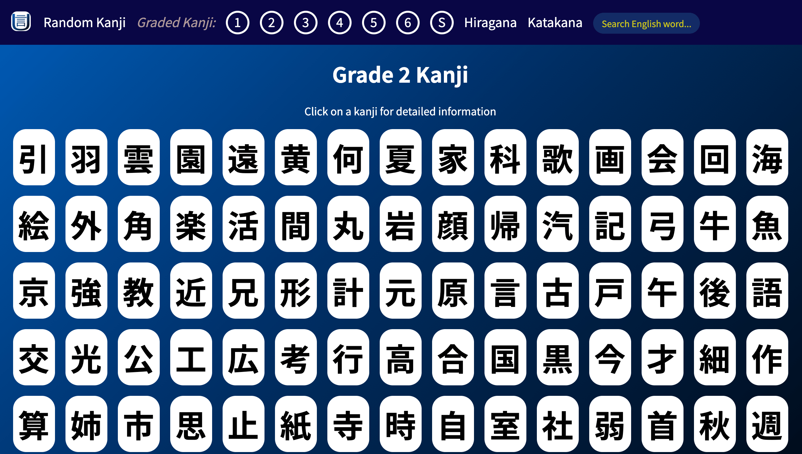
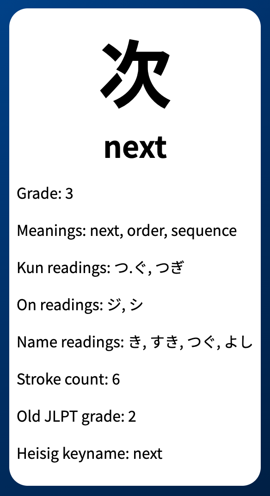
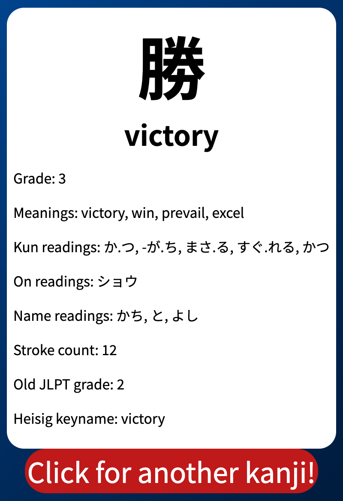
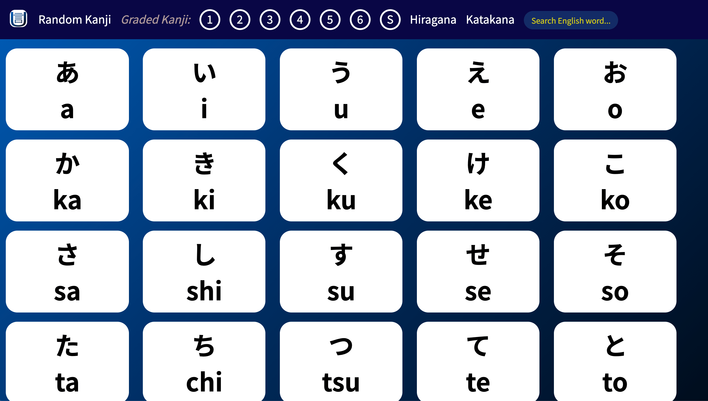
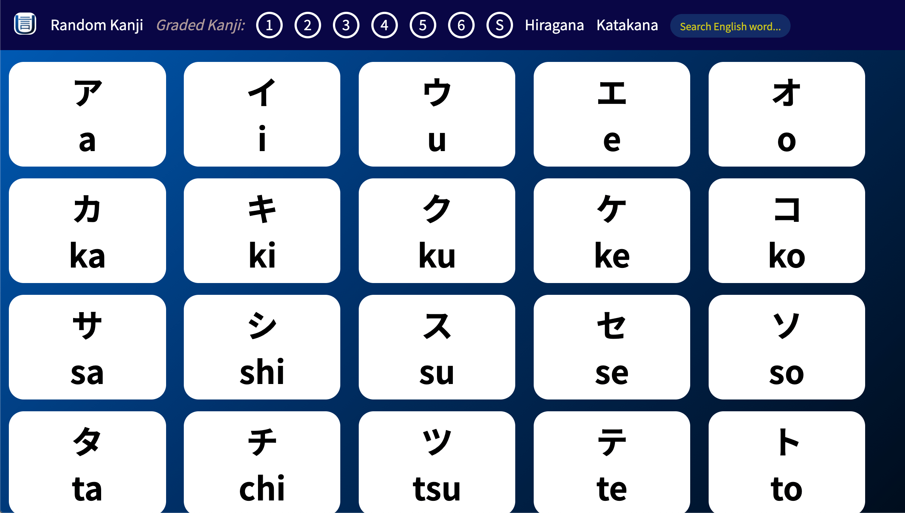
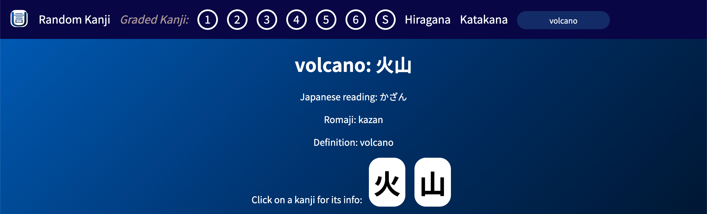

# [Ukana](https://deanspooner.github.io/ukana/) by [Dean Spooner](https://github.com/DeanSpooner)

## Your place for Japanese language-learning!

---

## Built with:

- React;
- HTML;
- CSS;
- JavaScript;
- Axios;
- kana-romaji.js.

---

## Features:

### Navbar

### Graded kanji

All kanji sorted by the grade that Japanese students learn them, from grades 1-6, and secondary, are listed. Click on a grade on the Navbar and learn different kanji from each grade.

### Kanji cards

Clicking on a mini-kanji card on a grade page, or an English-searched word page, will lead you to more information about that kanji, including meanings, readings, JLPT levels and more.

### Random kanji

You can click this to select any one of the 2,136 jōyo kanji at random and see its kanji card!

### Hiragana

Here you can study the different hiragana characters and their pronunciations. Hiragana are often used for simple or common words and grammar. They are usually the first set of written Japanese to be learnt!

### Katakana

Here you can study the different katakana characters and their pronunciations. There are exactly the same amount (and pronunciations) of katakana as there are hiragana! They are almost always used for foreign names, scientific names for plants, and loanwords (words that originally aren't from Japanese). Katakana is usually the second set of written Japanese to be learnt!

### Search

You can search for any English word and see its meaning. This is a work-in-progress, but does return some basic information, including Japanese writing and pronunciation. More results (and much more styling..!) will be added to this in future updates.
<>

---

# By [Dean Spooner](https://github.com/DeanSpooner), 2021

